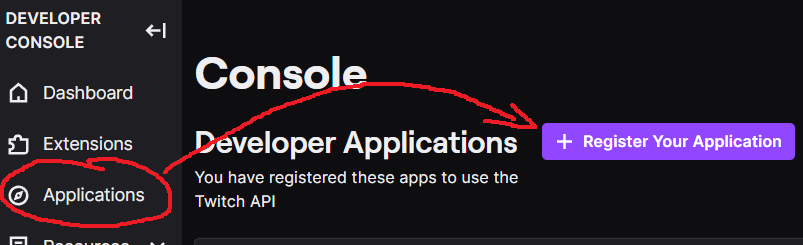
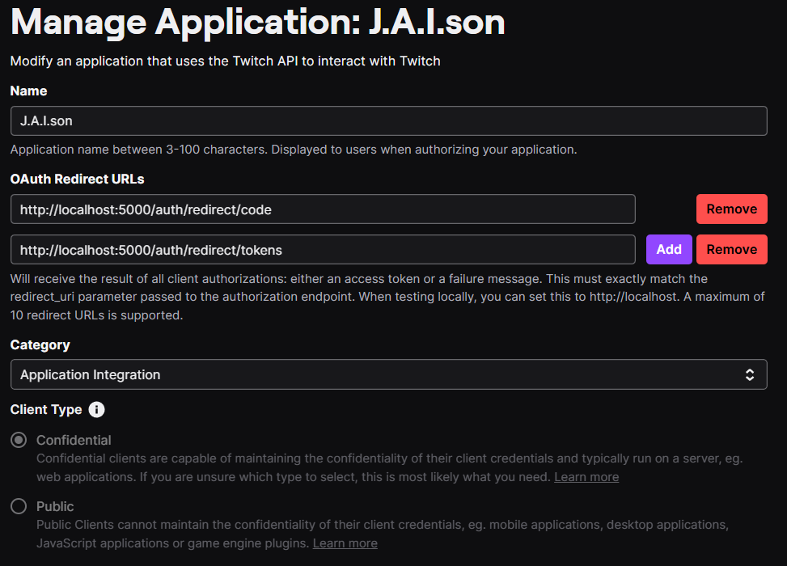

## About The Project

Twitch chat and Twitch alerts app plugin for [Project J.A.I.son](https://github.com/limitcantcode/jaison-core). Detects most of the alertable events and updates jaison-core with Twitch chat every second.

### Installation

This project was tested on python3.12

1. Create and activate your virtual environment using `conda` or `venv`.
2. Install dependencies `pip install -r requirements.txt`
3. Setup [Twitch application](https://dev.twitch.tv/console) and `.env`. Give it the redirects `http://localhost:5000/auth/redirect/code` and `http://localhost:5000/auth/redirect/tokens`

You can name it whatever you want. Just give it the following `OAuth Redirect URLs`, `Category`, and `Client Type`.

Once you created your new application, click `Manage` and copy the `Client ID` and `Client Secret` into your `.env` file following `.env-template`.

5. Setup `config.yaml` to where [jaison-core](https://github.com/limitcantcode/jaison-core) is running, where you want to store your Twitch tokens on your computer (somewhere safe that you won't accidently leak), and your Twitch user id. You can get your Twitch user id [here](https://www.streamweasels.com/tools/convert-twitch-username-%20to-user-id/) and use that for both the `twitch-bot-id` and `twitch-target-id`. These should be surrounded by `"`, for example: `"786978930"`. Available options for `chat-mode` are `ALL` (all messages appear like texting),`KEYWORD` (filter messages that specify keywords in `chat-keywords` comma-separated),`HIGHLIGHT` (filter only highlighted messages),`BITS` (filter only messages with at least `chat-bits-threshold` bits), and `DISABLE` (turn off).

6. Authenticate the application. Run `python ./src/auth.py`. You should see a warning log starting with `Can't subscribe to events until authenticated.`. Click on the link there and authenticate through Twitch.

## Usage

After setting things up, you can simply run `python ./src/main.py`

For runtime options, run `python ./src/main.py --help`

## Contributing

Any contributions you make are **greatly appreciated**.

If you have a suggestion that would make this better, please fork the repo and create a pull request. You can also simply open an issue with the tag "enhancement".
Don't forget to give the project a star! Thanks again!

1. Fork the Project
2. Create your Feature Branch (`git checkout -b feature/AmazingFeature`)
3. Commit your Changes (`git commit -m 'Add some AmazingFeature'`)
4. Push to the Branch (`git push origin feature/AmazingFeature`)
5. Open a Pull Request

## License

Distributed under the MIT License. See `LICENSE.txt` for more information.

## Contact

Project J.A.I.son: https://github.com/limitcantcode/jaison-core

Join the community Discord: https://discord.gg/Z8yyEzHsYM
