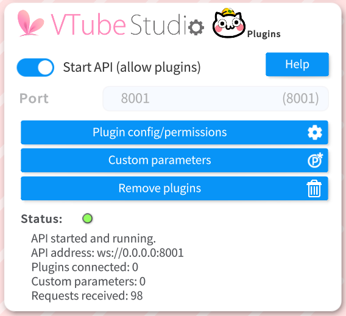
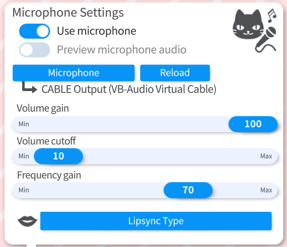
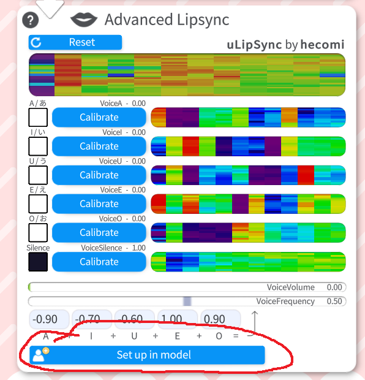
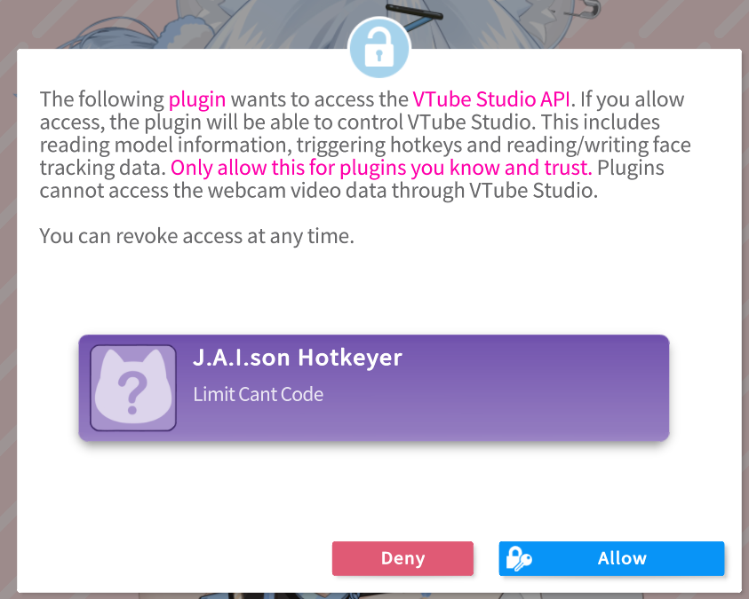
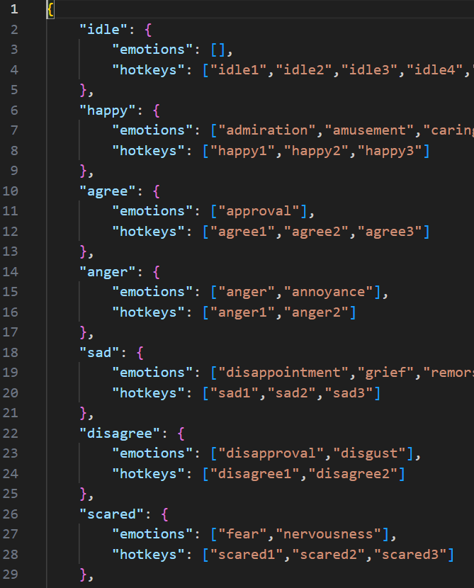
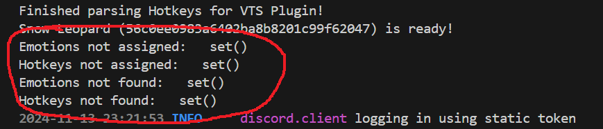

## About The Project

[VTube Studio](https://denchisoft.com/) Animation Hotkeyer app plugin for [Project J.A.I.son](https://github.com/limitcantcode/jaison-core). Loops idle animations and reacts to messages from jaison-core.

### Installation

This project was tested on python3.12

1. Create and activate your virtual environment using `conda` or `venv`.
For `conda`:
```
conda create -n jaison-app-vts python=3.12 cudatoolkit -c nvidia -y
conda activate jaison-app-vts
```

For `venv`:
```
python -m venv venv
# For Windows: ./venv/Scripts/activate
# For Unix: source venv/bin/activate
```

2.  Install your machine-specific version of [pytorch](https://pytorch.org/get-started/locally/)
3. Install dependencies `pip install -r requirements.txt`
4. Create a vts_hotkeys config file. Refer to [Customizing VTuber](#customizing-vtuber).
5. Follow [Setting up the VTuber](#setting-up-the-vtuber)
6. Setup `config.yaml` to where [jaison-core](https://github.com/limitcantcode/jaison-core) is running, where VTube Studio API is running, and which vts_hotkeys config file to use (filepath).

## Usage

After setting things up, you can simply run `python ./src/main.py`

For runtime options, run `python ./src/main.py --help`

## Setting up the VTuber
This project makes use of [VTube Studio](https://denchisoft.com/) to render the VTuber model. After [customizing your VTube model](#customizing-vtuber), you will need to go to `General Settings & External Connections` in settings. First enable the plugins API:



Keep note of the API address listed here. If running on WSL, you will need to replace the IP address (`0.0.0.0` in `ws://0.0.0.0:8001`) with the actual IP address of the computer you are running VTube Studio on (you can simply use your home network IPv4 address, gotten by running `ipconfig` in a Command Prompt and should start with `192.168...`).

Further down, you will need to enable the microphone:



You may select either Simple or Advanced Lipsync, it doesn't matter. If you select Advanced Lipsync, you need to click `Set up in model` (`Ok` on deleting parameters if it asks).



Before leaving to the next part, pick the microphone input. For now it is recommended you get [Voicemeeter](https://vb-audio.com/Voicemeeter/) and [virtual audio cable](https://vb-audio.com/Cable/). In VTube studio, set the input to the virtual audio cable. In Voicemeeter, set the outputs to your listening device and the virtual audio cable. At the time of writing, this application does not output audio and will be added back in the future. For now, set the application playing the audio response from jaison-core to use the Voicemeeter input.

Next, in VTube Studio, go to the `Model Settings` and find paramters for mouth open and mouth form. Change the input to form and open to `VoiceFrequency` and `VoiceVolumn` respectively.


The first time you run this project, you will need to authenticate some plugins on VTube Studio. A pop-up will automatically appear. Just hit `Allow` on both plugins.



These were just the minimal setup instructions to connect the program to your VTube model and sync mouth movement to speaking, however there is still more to do to setup animations and general VTuber movement/expressions. Refer to [Customizing Vtuber](#customizing-vtuber)

## Customizing VTuber
This section DOES NOT go over making a model or the basics of how to use VTube Studio (there are plenty of tutorials online). Instead, this section will explain how to get animations and actions from VTube Studio into this project.

Firstly, in VTube Studio, navigate to the `Hotkey Settings & Expressions`. We will add an animation, but the process is the same for expressions and other hotkeyable actions. Here you will find a list of hotkeys and actions:


Create as many as you like. Just make sure the name is unique. For each animation, selection `Play Animation...` within `Hotkey Action`, and select the animation you want to play (in my case, `idle1` which for me is in `idle1.motion3.json`). You can create animations by recording yourself performing with `Record Live2D Animation` found at the bottom of `Webcam ... Settings`, or you can create them using Live2D Cubism editor (same one used for making a custom model). Again, there are video tutorials for this.

For our project to use these hotkeys, create a config under `./vts_hotkeys`. There are some examples there.



In that same directory is a list of detectable emotions. We map a group of detectable emotions to a group of hotkeys that can potentially be played when that emotion is detected. We refer to each mapping as a "hotkey set". In the above example, we have "hotkey sets" `idle`, `happy`, `agree`, etc (seen on the right). The first "hotkey set" is the set of hotkeys that will be used when idle (not speaking). You may still put emotions in there. Furthermore, **ONLY USE DETECTABLE EMOTIONS ONCE**. That emotion will only be used in the first "hotkey set" listed if it appears in multiple. Detectable emotions go under the `emotions` list while the name of the hotkey goes into the `hotkeys` list.

Your hotkeys are now all setup.

Everytime you run this project and things are setup, you may find the following section in the outputs:



These are meant to help you see which detectable emotions or existing VTube Studio hotkeys were not included in the config file (`... not assigned`) and which in the config isn't a detectable emotion or VTube Studio hotkey (`... not found`).

## Contributing

Any contributions you make are **greatly appreciated**.

If you have a suggestion that would make this better, please fork the repo and create a pull request. You can also simply open an issue with the tag "enhancement".
Don't forget to give the project a star! Thanks again!

1. Fork the Project
2. Create your Feature Branch (`git checkout -b feature/AmazingFeature`)
3. Commit your Changes (`git commit -m 'Add some AmazingFeature'`)
4. Push to the Branch (`git push origin feature/AmazingFeature`)
5. Open a Pull Request

## License

Distributed under the MIT License. See `LICENSE.txt` for more information.

## Contact

Project J.A.I.son: https://github.com/limitcantcode/jaison-core

Join the community Discord: https://discord.gg/Z8yyEzHsYM
